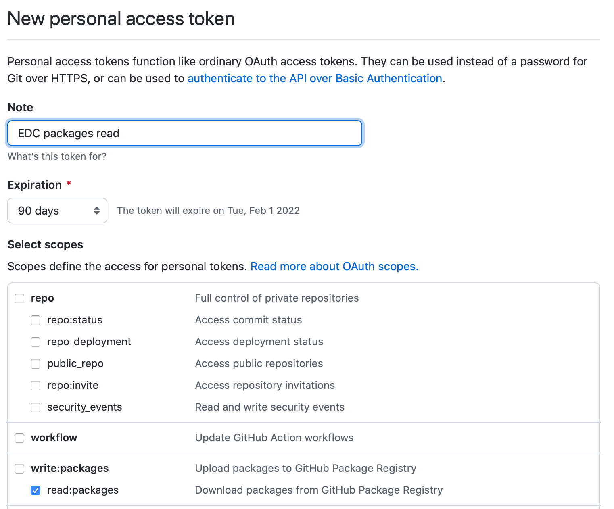

## Git token

Create a token in GitHub, limited to **read:packages** scope.



## Local build

Copy `settings.xml` into your `~/.m2/` folder (or merge it with a file already there), and replace the environment variable references with the following:

```
<username>your_github_username</username>
<password>your_github_pat_token</password>
```


## Docker build

```
docker build  --build-arg GITHUB_PKG_USERNAME=your_github_username --build-arg GITHUB_PKG_PASSWORD=your_github_pat_token --progress=plain .
```
